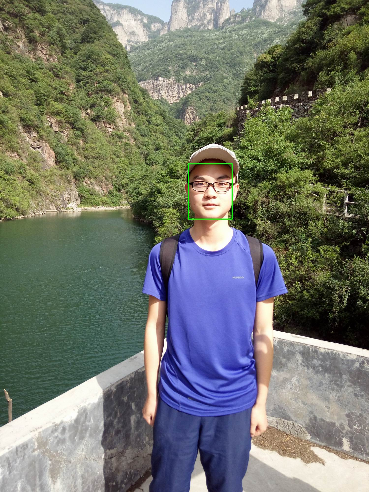
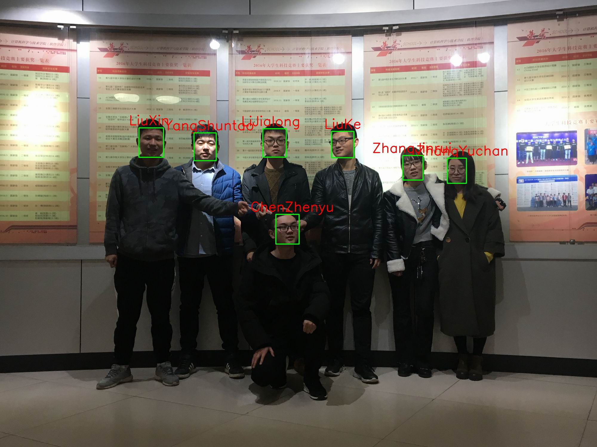

# 中文请参考我的[CSDN博客](https://blog.csdn.net/chenzhenyu123456/article/details/80751477)

# Introduction
This is a Face-recognition demo that I combined with MTCNN<sup>[1]</sup> and FaceNet<sup>[2]</sup> under the PyCharm IDE. It can train any dataset and implement face verification, face recognition and face search functions. Finally, I used Tkinter to make the interface, and the user could easily operate it. Anyway if you want to learn face recognition or Tkinter UI, I believe my project will help you.

# Results
- Face Verification (Verification `ChenZhenyu`)
>Successful Verification! This image was identified as ChenZhenyu!

>
- Face Recognition
>Detected LiuXin,YangShuntao,LiJialong,ChenZhenyu,LiuKe,ZhangYuchan,ZhangJinrui in this image!

>
- Face Search (search `ChenZhenyu`, `LiuKe`)
>Found ChenZhenyu,LiuKe in this image! 

>

# Environment
- Windows 10
>Python 3.6.4 + TensorFlow 1.6.0 + tk 8.5.19 + dlib 19.4 + opencv 3.4.1 + scikit-image 0.13.0 + scikit-learn 0.19.1
- Ubuntu 16.04
>Python 3.6.2 + TensorFlow 1.3.0 + tk 8.5.18 + dlib 19.4 + opencv 3.1.0 + scikit-image 0.13.0 + scikit-learn 0.19.0

Under Ubuntu, it is recommended that you choose English (Chinese display sometimes has problems).


# UI Display 
Windows (The program can also run under Ubuntu system)
## Login
</br>

## Train
</br>

## Retrieval 
Search the images and display them on the right side of the UI</br>

## Predict 
Visualize the result of the image on the right side of the UI</br>


# Notebook Display
Please see [face_recognition_process.ipynb](https://github.com/zhenyuczy/Face-recognition/blob/master/face_recognition_process.ipynb). It will help you to understand my code.

# How to use it
- Download my resources and place them in the folder `resources`
  >Google Driver: https://drive.google.com/file/d/19WKS0aDJy9ncmWCR8ScvcmEU8tmDZoEM/view?usp=sharing</br>
  >BaiDu Cloud: https://pan.baidu.com/s/1SOBR0eUQvUyYutuhHxLfsQ
- Download the MTCNN weights and place them in the folder `models/mtcnn`
  >Google Driver: https://drive.google.com/file/d/12r98MQsxy4_cPekGpQD7BknPm5Tdyd7b/view?usp=sharing</br>
  >BaiDu Cloud: https://pan.baidu.com/s/178wilMLklTdjavE5k_SRDA
- Download the FaceNet weights and place it in the folder `models/20170512-110547`
  >Google Driver: https://drive.google.com/file/d/1aQjhcidR3z2YbjB0qYIFDpJChiP3n7Zy/view?usp=sharing</br>
  >BaiDu Cloud: https://pan.baidu.com/s/15UsfsxfLu3iSZSfuqVmx-g
- If you need to perform face alignment, you must download alignment model and put it under the `models` folder.
  >Google Driver: https://drive.google.com/file/d/1C09m6bb2MAkM4G3cBhtsuRuW3S-qmgD5/view?usp=sharing</br>
  >BaiDu Cloud: https://pan.baidu.com/s/1uUCs9HaKtkv6Q5ST55nLbw
- After completing the above steps, you can implement face recognition with jupyter notebook.
- If you need to use the UI, open it in PyCharm IDE and run `ui_with_tkinter/choose_language.py`.

# Folder Structure
```
models/
----------20170512-110547/
--------------------20170512-110547.pd
--------------------model-20170512-110547.ckpt-250000.data-00000-of-00001
--------------------model-20170512-110547.ckpt-250000.index
--------------------model-20170512-110547.meta
----------mtcnn/
--------------------det1.npy
--------------------det2.npy
--------------------det3.npy
----------my_models/
----------shape_predictor_68_face_landmarks.dat
dataset/
----------train_english/
--------------------XiaoMing/
------------------------------XiaoMing1.jpg
------------------------------...
--------------------XiaoHu/
------------------------------XiaoHu1.jpg
------------------------------...
--------------------...
----------train_chinese/
--------------------小明/
------------------------------XiaoMing1.jpg
------------------------------...
--------------------小虎/
------------------------------XiaoHu1.jpg
------------------------------...
--------------------...
```
# Reference
[1] [MTCNN](https://kpzhang93.github.io/MTCNN_face_detection_alignment/)</br>
[2] [FaceNet](https://www.cv-foundation.org/openaccess/content_cvpr_2015/papers/Schroff_FaceNet_A_Unified_2015_CVPR_paper.pdf)


